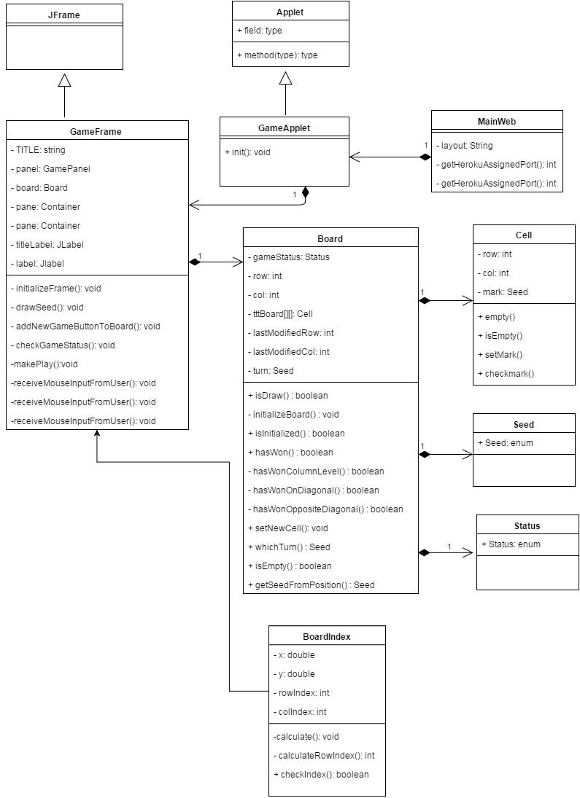

# Design report
## TicTacToe 
TicTacToe (also known as Noughts and crosses or Xs and Os) is a game for two players, X and O, who take turns marking the spaces in a 3x3 grid. The player who succeeds in placing three of their marks in a horizontal, vertical, or diagonal row wins the game.

## Short version design description
The game was designed as an graphical Java applet. 
The frame is in Html and is rendered with velocityTemplateEngine, and the applet itself is embedded in standard .jar. The user input comes from the mouse click. 

## Coding conventions

The following rules are checked by the stylecheck plugin. Code does not pass inspection if they are broken.

1. There should be no tab characters in the code, indents should be four spaces.
2. All classes should end with an empty line.
3. There should be no redundant imports.
4. Lines should not exceed 100 characters.
5. Scope blocks should be opened in the same line as the scope is declared.
6. All if and else blocks shall have braces around them.
7. Operators and tokens such as "if", "else" and "for" should be surrounded by whitespace for readability.
8. Semicolons and typecasts shall be followed by whitespace.

## Naming conventions

1. Pascal casing is used for classes.
2. Camel casing is used for variables and methods.

## Class diagram

